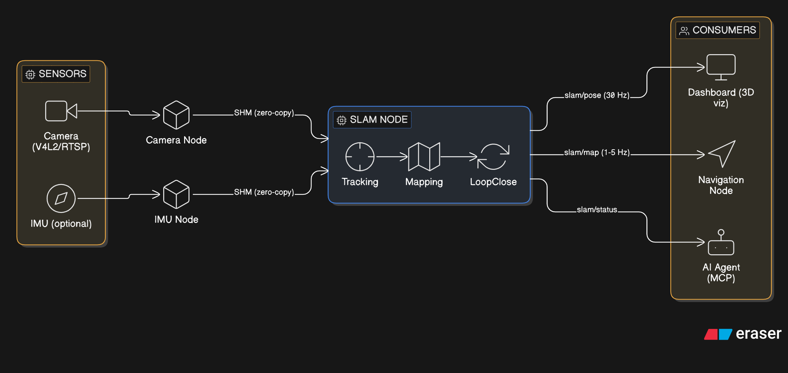
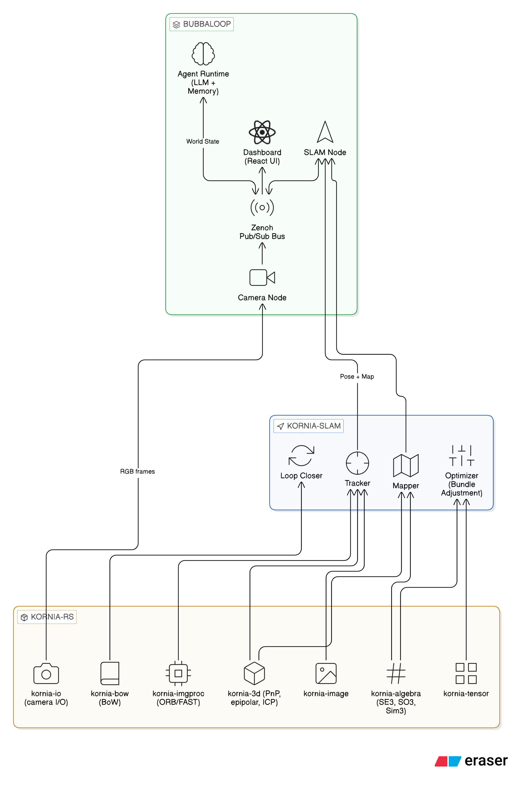
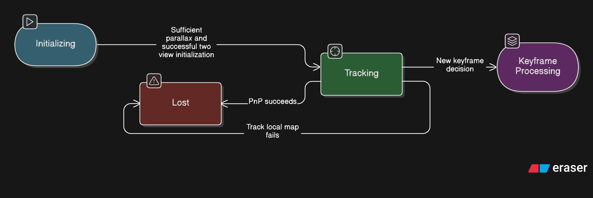
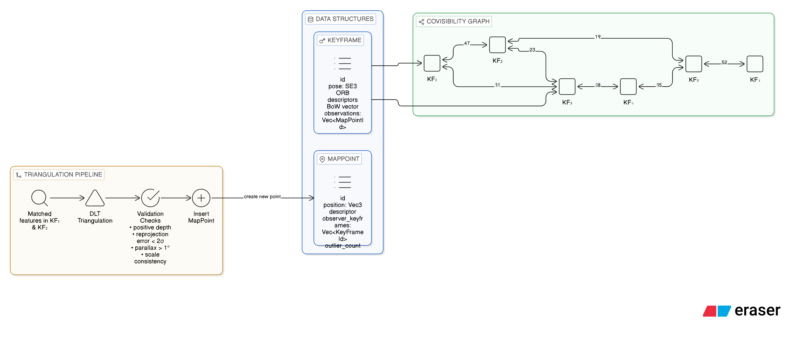
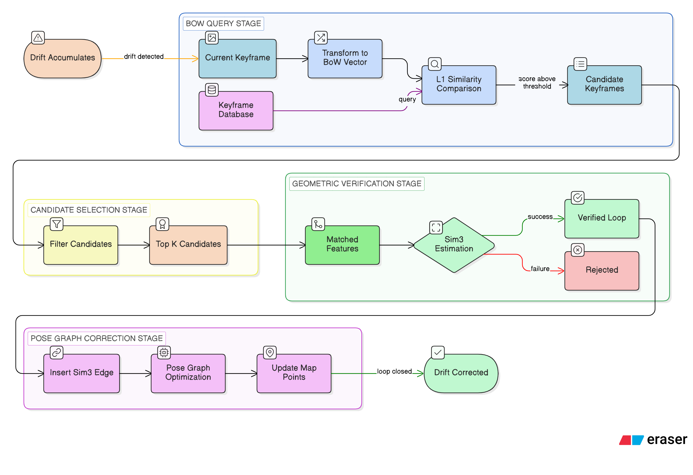
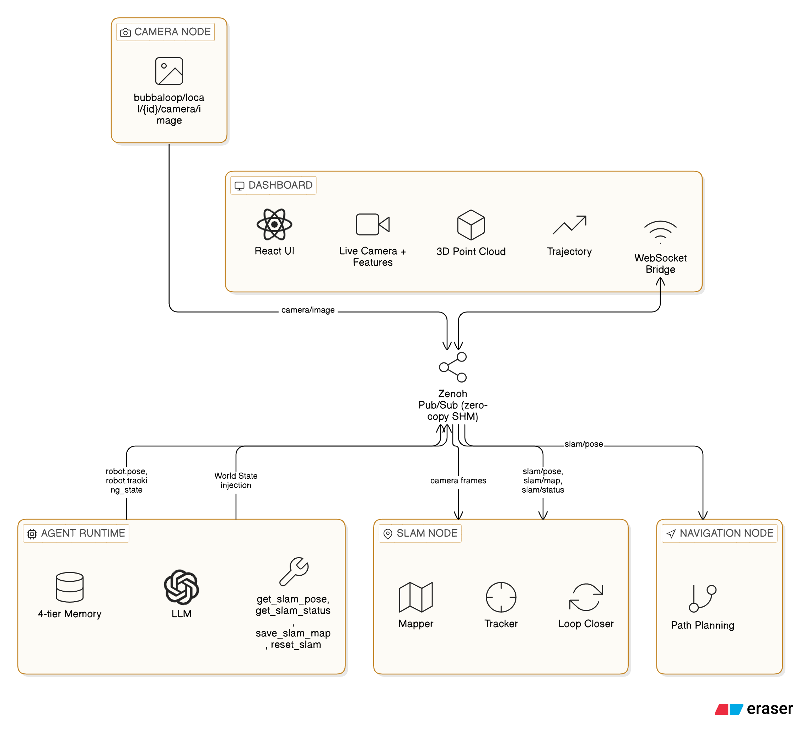
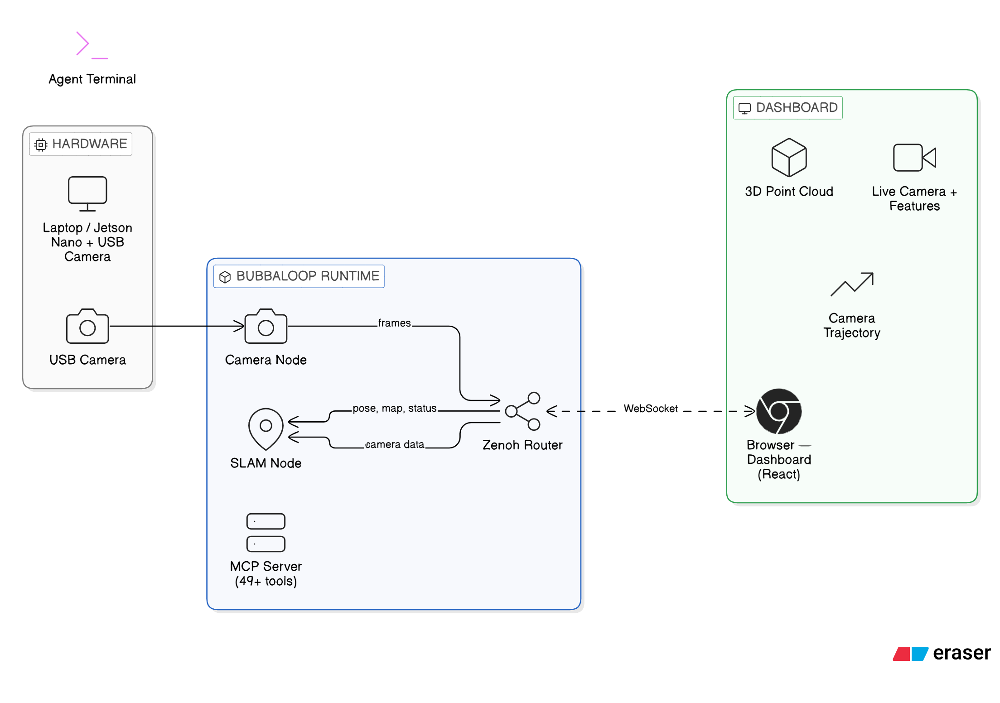
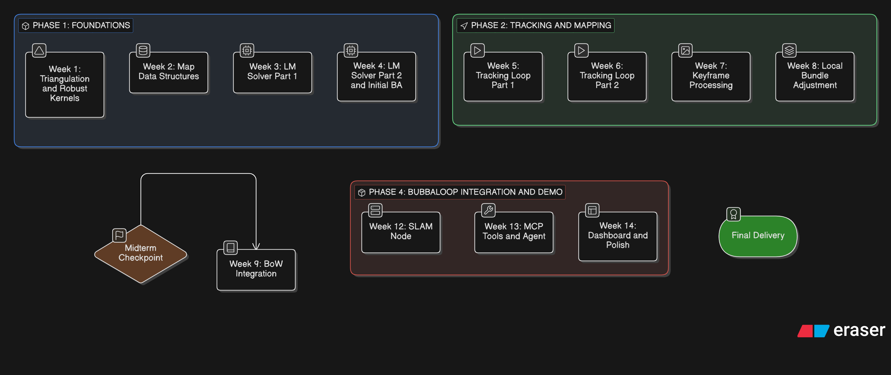

# GSoC Draft Proposal : Real-Time Visual SLAM for the Kornia Ecosystem with Bubbaloop Agent Integration

**Organization:** Kornia
**Project Size:** Large (~350 hours)
**Difficulty:** Hard

---

## Table of Contents

1. [Introduction](#1-introduction)
2. [About Me](#2-about-me)
3. [Motivation](#3-motivation)
4. [Proposed Application](#4-proposed-application)
5. [Current Ecosystem Analysis](#5-current-ecosystem-analysis)
6. [Problem Statement](#6-problem-statement)
7. [Proposed Technical Approach](#7-proposed-technical-approach)
   - [7.1 SLAM Frontend](#71-slam-frontend)
   - [7.2 Mapping System](#72-mapping-system)
   - [7.3 Optimization](#73-optimization)
   - [7.4 Loop Closure](#74-loop-closure)
   - [7.5 Bubbaloop Integration](#75-bubbaloop-integration)
8. [Contributions to Kornia Projects](#8-contributions-to-kornia-projects)
9. [Demo Application](#9-demo-application)
10. [Evaluation Plan](#10-evaluation-plan)
11. [Timeline](#11-timeline)
12. [Risks and Mitigation](#12-risks-and-mitigation)
13. [Prior Contributions and Why Me](#13-prior-contributions-and-why-me)
14. [Conclusion](#14-conclusion)

---

## 1. Introduction

This proposal presents the development of a real-time visual SLAM application built on the Kornia ecosystem and deployed as a native Bubbaloop node. The goal is to demonstrate how Kornia’s Rust vision primitives and Bubbaloop’s robotics runtime can be combined into a working spatial perception system capable of running on edge hardware.

The final deliverable will be a fully reproducible demo application: a camera-equipped device (laptop or Jetson-class edge computer) running Bubbaloop, where a SLAM node processes live camera frames, estimates camera pose, incrementally builds a sparse 3D map, and publishes spatial state over Zenoh topics. This spatial information can then be consumed by other nodes such as navigation modules, visualization dashboards, or AI agents.

The Kornia ecosystem already provides many of the low-level components required for such a system. kornia-rs includes feature detection, descriptor matching, epipolar geometry, PnP pose estimation, Lie group representations (SE(3), Sim(3)), and Bag-of-Words place recognition primitives. Bubbaloop, in turn, provides a distributed runtime where sensor nodes publish data streams and AI agents interact with system state through a unified MCP interface.

However, the ecosystem currently lacks an integrated system that turns these primitives into a complete spatial perception pipeline. The existing kornia-slam repository demonstrates early pose estimation experiments but does not implement a full SLAM system with tracking, mapping, optimization, and loop closure.

This project addresses that gap by implementing the missing infrastructure required to build a modular visual SLAM pipeline in Rust, and integrating it as a Bubbaloop node that exposes spatial state directly to the runtime. This enables agents to reason about robot pose, map structure, and tracking status in real time, moving the Kornia ecosystem toward a practical spatial intelligence platform for robotics and edge AI systems.

---

## 2. About Me

> **Name:** Arkin Kansra
> **University:** GGSIPU DWARKA , INDIA 
> **Program / Semester:** B.Tech CSE (AI), 4th Semester
> **Email:** arkinkansra@gmail.com
> **GitHub:** https://github.com/arc-wonders
> **Timezone:** IST +5:30 
> **LinkedIn :** https://www.linkedin.com/in/arkin-kansra/
>
> I am a computer science student with a strong interest in computer vision, robotics perception, and systems programming. My work has focused on building real-time vision systems using Rust , Python , C++ and modern machine learning frameworks. I have also contributed to the Kornia ecosystem and developed experimental visual odometry pipelines to better understand the foundations of SLAM systems.

---

## 3. Motivation

### Why Spatial Perception Matters

Autonomous robots need to answer a fundamental question in real-time: *"where am I and what is around me?"* Simultaneous Localization and Mapping (SLAM) is the algorithmic framework that answers this: it estimates the robot's 6-DOF pose while building a persistent map of the environment. Without SLAM, a robot cannot navigate, cannot plan paths, and cannot relate physical observations across time.

Every mobile robot, drone, self-driving car, and AR device depends on some form of spatial perception. SLAM is the foundational layer on which planning, navigation, and manipulation systems are built.

### Why Kornia + Bubbaloop

The Kornia ecosystem is uniquely positioned to become a **modern, Rust-native spatial intelligence platform**.

#### kornia-rs provides the vision primitives required for SLAM

- ORB feature detection and binary descriptors  
- Descriptor matching with Hamming distance and ratio tests  
- Epipolar geometry and two-view estimation  
- PnP pose estimation solvers  
- Lie group representations (**SE(3)**, **Sim(3)**) with analytical Jacobians  
- Bag-of-Words place recognition infrastructure  

These components already exist as **high-performance SIMD-accelerated Rust implementations**, but they are currently used only as isolated primitives rather than as part of a complete SLAM pipeline.

#### Bubbaloop provides the runtime that makes SLAM useful in real systems

- Real-time sensor pipelines through **Zenoh pub/sub**
- Self-contained **node architecture** for perception modules
- **Queryable system state** through Zenoh endpoints
- Direct **agent interaction through MCP tools**

Instead of a standalone SLAM executable that writes logs or CSV files, a Bubbaloop node can publish:

- live pose estimates  
- map updates  
- tracking state  

This allows other components — navigation modules, dashboards, or AI agents — to consume spatial information directly from the runtime.

#### Rust enables reliable real-time robotics software

Rust provides guarantees that are particularly valuable for embedded robotics systems:

- No garbage collector  
- Deterministic memory management  
- Thread safety without data races  
- Small deployable binaries (~11–13 MB for the Bubbaloop runtime)

These properties make Rust well-suited for **real-time SLAM on resource-constrained edge hardware**.

#### Gap in the current ecosystem

No existing open-source SLAM system combines these properties:

- **ORB-SLAM3** — C++ implementation, GPL licensing, tightly coupled with OpenCV  
- **RTAB-Map** — feature-rich but heavy and strongly tied to ROS  
- **Stella-VSLAM** — modern C++ SLAM system but without agent-based integration  

This project fills that gap by combining:

- **Rust-based vision primitives (kornia-rs)**
- **A robotics runtime (Bubbaloop)**
- **Agent-accessible spatial state through MCP**

The result is a **modular, edge-ready SLAM system that integrates directly with modern AI agent workflows.**

---

## 4. Proposed Application

### Demo Application Description

The demo application is a **real-time visual SLAM system running as a Bubbaloop node** on a laptop or Jetson device with a monocular camera.

**What the user sees:**

1. Start Bubbaloop with a YAML skill file:
   ```yaml
   name: visual-slam
   driver: slam
   config:
     camera_topic: bubbaloop/local/laptop/camera/image
     vocabulary_path: /data/models/orb_vocab.bin
     num_features: 2000
     num_levels: 8
   ```
2. `bubbaloop up` starts the Zenoh router, camera node, and SLAM node.
3. The **Bubbaloop dashboard** (React UI at localhost:8080) displays:
   - Live camera feed with tracked features overlaid
   - 3D trajectory visualization (camera poses over time)
   - Sparse 3D point cloud (map points)
   - SLAM status panel (tracking state, FPS, keyframe count, map points count)
4. An **AI agent** can query spatial state via MCP:
   - *"Where is the robot?"* → reads `robot.pose` from Tier-0 world state
   - *"How many places have been mapped?"* → calls `get_slam_status` MCP tool
   - *"Save the current map"* → calls `save_slam_map` MCP tool
5. If the camera revisits a previously seen area, **loop closure** fires: the trajectory corrects globally and the agent receives a world state update.

### Conceptual Data Flow



---

## 5. Current Ecosystem Analysis

### 5.1 kornia-rs

kornia-rs (v0.1.11) is a workspace of 11 Rust crates providing low-level vision primitives:

| Crate | Purpose | SLAM Relevance |
|---|---|---|
| `kornia-tensor` | N-D tensor with pluggable allocators | Underlying data structure for all computations |
| `kornia-image` | `Image<T,C,A>` with type-safe color spaces | Input type for every feature detector |
| `kornia-algebra` | Lie groups (SO3, SE3, Sim3), SIMD linear algebra | Pose representation and Jacobians for optimization |
| `kornia-imgproc` | Features (ORB, FAST, Harris), filters, warp, calibration | Feature extraction, matching, image pre-processing |
| `kornia-3d` | PnP, epipolar geometry, ICP, point clouds | Pose estimation and 3D geometry |
| `kornia-bow` (module in kornia-rs) | Hierarchical vocabulary tree, BoW scoring | Loop closure detection |
| `kornia-io` | Image/video I/O (JPEG, GStreamer, V4L2) | Camera frame ingestion |
| `kornia-apriltag` | Fiducial marker detection | Scale recovery, validation |

The primitives are individually mature. ORB features include multi-scale detection, orientation assignment, and 256-bit binary descriptors. PnP includes EPnP with Levenberg-Marquardt refinement and RANSAC wrapping. The Lie group implementations include analytical left and right Jacobians needed for manifold optimization. The BoW library implements vocabulary training, IDF-weighted scoring with six distance metrics, and a direct index for feature-guided matching.

**What is present:** all front-end vision components (detect, describe, match, estimate).
**What is missing:** all back-end optimization components (triangulation, bundle adjustment, pose graph solver).

### 5.2 kornia-slam

kornia-slam is an early-stage Python prototype (~360 lines, 4 files, 0 tests):

- **Two-view pose estimation** via MadPose hybrid RANSAC — accepts pre-computed keypoints
- **RGBD odometry** via Open3D — pairwise frame-to-frame, no temporal chaining
- **ICP registration** via Open3D — demo code, main loop commented out
- **Rerun visualization** — well-integrated 3D rendering

It demonstrates individual algorithms in isolation. There is no tracking loop, no map data structure, no keyframe management, no optimization, and no persistent state. Ceres solver is in the dependencies but unused.

**Current state:** proof-of-concept demonstrating that pose estimation works. Not yet a SLAM system.

### 5.3 Bubbaloop

Bubbaloop (v0.0.11) is a Rust edge-AI runtime with:

- **Zenoh data plane** — zero-copy pub/sub with SHM for co-located processes (6 MB camera frames at memory-copy speed)
- **Node SDK** — 50-line pattern for self-describing sensor processes (5 standard queryables: schema, manifest, health, config, command)
- **Daemon** — node lifecycle management (systemd D-Bus), telemetry watchdog, context providers
- **Agent Runtime** — multi-agent LLM loops with 4-tier memory (world state → short-term → episodic → semantic)
- **MCP Server** — 49 tools as the sole control interface; 3-tier RBAC; stdio and HTTP transport
- **Dashboard** — React UI consuming Zenoh via WebSocket bridge

Topic naming: `bubbaloop/{scope}/{machine_id}/{node_name}/{subtopic}`

Bubbaloop provides everything needed to host a SLAM node: camera ingestion, pub/sub transport, world state injection, agent reasoning, and web visualization. What it lacks is a SLAM node to put in the pipeline.



---

## 6. Problem Statement

The Kornia ecosystem has the **pieces** for spatial perception but not the **assembly**:

| Layer | Has | Missing |
|---|---|---|
| **Primitives** (kornia-rs) | ORB features, PnP, epipolar geometry, Lie groups, BoW | Triangulation (standalone), non-linear optimization on manifolds, robust kernels |
| **Algorithms** (kornia-slam) | Two-view pose demo, RGBD odometry demo | Tracking loop, map data structures, keyframe management, bundle adjustment, pose graph optimization, loop closure pipeline |
| **Runtime** (Bubbaloop) | Node SDK, Zenoh transport, MCP tools, agent runtime | SLAM node, SLAM-specific MCP tools, pose/map Zenoh topics |

**The core problem:** there is no system that takes a stream of camera frames and continuously produces 6-DOF pose estimates and a 3D map. Each component exists in isolation, but the pipeline does not exist.

Concretely, the following must be built:

1. **Triangulation routines** in kornia-3d (midpoint, DLT) — to create 3D map points from 2D correspondences.
2. **A non-linear least squares solver** that operates on SE(3) manifolds — to run bundle adjustment and pose graph optimization.
3. **Map data structures** — KeyFrame, MapPoint, CovisibilityGraph — that maintain the spatial model.
4. **A tracking loop** — a state machine that receives frames, extracts features, matches against the local map, estimates pose via PnP, and decides when to create keyframes.
5. **Local bundle adjustment** — sliding-window optimization of recent keyframe poses and their observed map points.
6. **Loop closure** — BoW-based place recognition (using the Bag-of-Words module in kornia-rs) followed by geometric verification and pose graph correction.
7. **A Bubbaloop SLAM node** — integrating the SLAM system into the node SDK, publishing pose/map/status topics, and exposing control via command queryables.
8. **MCP tools** — allowing agents to query pose, manage maps, and monitor SLAM health.

---

## 7. Proposed Technical Approach

### 7.1 SLAM Frontend

The frontend is responsible for processing each incoming frame and estimating the camera pose.

**Feature Extraction:** Each frame is converted to grayscale (kornia-imgproc `gray_from_rgb`), then processed by `OrbDetector` with the following configuration:

| Parameter | Value | Rationale |
|---|---|---|
| `n_keypoints` | 2000 | Sufficient coverage for indoor/outdoor scenes |
| `n_scales` | 8 | Scale invariance across factor-of-10 depth range |
| `downscale` | 1.2 | Standard scale pyramid ratio |
| `fast_threshold` | 20 / 7 | Two-tier: aggressive initial, relaxed fallback |
| `cell_size` | 30 | Octree spatial distribution for uniform coverage |

Output: `OrbFeatures { keypoints, descriptors: [[u8; 32]], scales, orientations }`.

**Tracking State Machine:**



**Initialization:** When in `INITIALIZING`, the system collects frame pairs and attempts two-view reconstruction:
1. Match ORB features between the reference frame and the current frame using `match_descriptors` with cross-check and Lowe's ratio test.
2. Estimate both a fundamental matrix (`fundamental_8point` + RANSAC) and a homography, then select the model using the ratio of inliers (following the Mur-Artal heuristic: prefer H if `score_H / (score_H + score_F) > 0.45`).
3. Extract the essential matrix (`essential_from_fundamental`), decompose it (`decompose_essential`), select the valid (R, t) via cheirality check.
4. Triangulate initial map points and run a small bundle adjustment to refine.

**Tracking:** When in `TRACKING`:
1. Project local map points into the current frame using the motion model (constant velocity prior or last known pose).
2. Search for matches in a radius around projected positions using `match_orb_descriptors`.
3. Estimate pose via `solve_pnp` (EPnP + RANSAC), then refine with LM.
4. Track additional local map points (from covisible keyframes) to improve the estimate.
5. Decide if this frame should become a keyframe (criteria: sufficient parallax, enough new unmatched features, minimum time since last keyframe).

**Relocalization (if LOST):** Query the BoW database (using `Vocabulary::transform` + `BoW::l1_similarity` from the Bag-of-Words module in kornia-rs) for candidate keyframes, then verify geometrically via PnP on matched features.


### 7.2 Mapping System

The mapping system maintains the persistent spatial model.

**Core Data Structures:**

```rust
pub struct MapPoint {
    pub id: u64,
    pub position: Vec3F32,             // world coordinates
    pub descriptor: [u8; 32],          // representative ORB descriptor
    pub normal: Vec3F32,               // mean viewing direction
    pub observations: Vec<(u64, usize)>, // (keyframe_id, keypoint_index)
    pub min_distance: f32,             // scale invariance: min observation distance
    pub max_distance: f32,             // scale invariance: max observation distance
}

pub struct KeyFrame {
    pub id: u64,
    pub pose: SE3F32,                  // camera-to-world transform
    pub intrinsics: Mat3F32,
    pub keypoints: Vec<Vec2F32>,
    pub descriptors: Vec<[u8; 32]>,
    pub bow_vector: BoW,               // for place recognition
    pub direct_index: DirectIndex,     // for guided matching
    pub map_point_indices: Vec<Option<u64>>,  // keypoint → map point ID
    pub connections: Vec<(u64, usize)>, // covisibility: (keyframe_id, shared_point_count)
}

pub struct SlamMap {
    pub keyframes: HashMap<u64, KeyFrame>,
    pub map_points: HashMap<u64, MapPoint>,
    pub covisibility_graph: CovisibilityGraph,
}
```

**Triangulation:** New map points are created when a new keyframe is inserted. For each unmatched feature in the new keyframe, we search for a match in connected keyframes (guided by the BoW direct index) and triangulate using DLT:

```rust
pub fn triangulate_dlt(
    p1: &Mat3x4F64,            // projection matrix of keyframe 1
    p2: &Mat3x4F64,            // projection matrix of keyframe 2
    x1: &[Vec2F64],            // observations in keyframe 1
    x2: &[Vec2F64],            // observations in keyframe 2
) -> Vec<Vec3F64>
```

Triangulated points pass through validation checks before insertion:
- Positive depth in both cameras (cheirality)
- Reprojection error below threshold (2σ)
- Parallax angle above minimum (1°)
- Scale consistency with existing map

**Covisibility Graph:** A weighted undirected graph where nodes are keyframes and edge weight is the number of shared map point observations. This graph defines "local" for local bundle adjustment and determines the set of keyframes to search during tracking.

**Map Point Maintenance:** Periodically cull map points with low observation counts (< 3 keyframes) or high outlier rates.



### 7.3 Optimization

This is the largest missing piece in the ecosystem. A generic Levenberg-Marquardt solver on Lie group manifolds must be implemented in kornia-3d.

**Design:**

```rust
pub trait Factor {
    fn residual(&self, variables: &VariableStore) -> DVecF64;
    fn jacobians(&self, variables: &VariableStore) -> Vec<(usize, DMatF64)>;
    fn robust_kernel(&self) -> Option<RobustKernel>;
}

pub enum RobustKernel {
    Huber(f64),     // ρ(s) = s if s ≤ δ², else 2δ√s − δ²
    Cauchy(f64),    // ρ(s) = c² log(1 + s/c²)
    Tukey(f64),     // ρ(s) = (c²/6)(1 − (1 − s/c²)³) if s ≤ c², else c²/6
}

pub struct LevenbergMarquardt {
    max_iterations: usize,
    cost_tolerance: f64,
    gradient_tolerance: f64,
    lambda_init: f64,
}
```

**Reprojection Factor:** The fundamental factor for bundle adjustment. Given a 3D point $\mathbf{p}_w$ and a camera pose $\mathbf{T}_{cw} \in SE(3)$, the residual is:

$$\mathbf{r} = \mathbf{u}_{obs} - \pi(\mathbf{T}_{cw} \cdot \mathbf{p}_w)$$

where $\pi$ is the pinhole projection. The Jacobian with respect to the pose (using tangent-space perturbation) is:

$$\frac{\partial \mathbf{r}}{\partial \boldsymbol{\xi}} = -\frac{\partial \pi}{\partial \mathbf{p}_c} \cdot \frac{\partial (\mathbf{T} \cdot \mathbf{p})}{\partial \boldsymbol{\xi}}$$

The SE(3) retraction (`SE3F32::retract`) and analytical Jacobians (`SE3F32::left_jacobian`) from kornia-algebra provide the manifold operations.

**Local Bundle Adjustment:** Triggered on keyframe insertion. Optimizes:
- Poses of the new keyframe and its covisible keyframes
- Positions of all map points observed by these keyframes
- Keyframes that observe the optimized points but are not themselves optimized contribute fixed observations (anchoring the gauge)

**Pose Graph Optimization:** Triggered on loop closure. Optimizes all keyframe poses with:
- Relative pose constraints (edges from odometry)
- Loop closure constraints (edges from verified revisits, weighted by Sim3 information)

The solver uses the Schur complement trick to exploit the sparse block structure of BA (pose–point bipartite graph), solving the reduced camera system first, then back-substituting for points.

### 7.4 Loop Closure

Loop closure corrects accumulated drift by detecting when the camera revisits a previously mapped area.

**Detection Pipeline:**

1. **BoW query:** Transform the current keyframe's ORB descriptors into a BoW vector using `Vocabulary::transform`. Compare against all keyframe BoW vectors in the database using `BoW::l1_similarity`. Candidates must exceed a minimum score and have a temporal gap from the current keyframe (to avoid matching nearby frames).

2. **Geometric verification:** For each candidate, perform feature matching guided by the direct index (`DirectIndex` restricts matching to features sharing the same vocabulary node, reducing search space). Estimate a Sim(3) transformation between the candidate and the query keyframe to account for possible scale drift in monocular SLAM.

3. **Correction:** Insert a Sim(3) edge into the pose graph between the loop keyframes. Run pose graph optimization to distribute the error across the trajectory. Update all map point positions to be consistent with the corrected poses.

**BoW Database Management:** Each keyframe's BoW vector is stored upon insertion. The database grows linearly with the number of keyframes. L1 similarity scoring is $O(|\text{BoW}|)$ per comparison (sparse vectors), and the direct index enables $O(1)$ per-feature lookup to shared vocabulary nodes.



### 7.5 Bubbaloop Integration

The SLAM system runs inside Bubbaloop as a standard node, following the Node SDK contract.

**SLAM Node Implementation:**

```rust
struct SlamNode {
    tracker: Tracker,
    loop_closer: LoopCloser,
    config: SlamConfig,
}

#[async_trait]
impl Node for SlamNode {
    type Config = SlamConfig;
    fn name() -> &'static str { "slam" }
    fn descriptor() -> &'static [u8] { include_bytes!("slam.descriptor.bin") }

    async fn run(self, ctx: NodeContext) -> Result<()> {
        let camera_sub = ctx.subscribe(&self.config.camera_topic).await?;

        loop {
            let frame = camera_sub.recv().await?;
            let result = self.tracker.process_frame(&frame);

            ctx.publish("slam/pose", result.pose.encode()).await?;

            if result.state_changed {
                ctx.publish("slam/status", result.status.encode()).await?;
            }
            if let Some(kf) = result.new_keyframe {
                ctx.publish("slam/keyframe", kf.encode()).await?;
            }
        }
    }
}
```

**Published Topics:**

| Topic | Rate | Content |
|---|---|---|
| `.../slam/pose` | 30 Hz | Quaternion + translation + tracking quality + covariance |
| `.../slam/status` | On change | Tracking state, keyframe count, map size, FPS, loop closures |
| `.../slam/map` | 1–5 Hz | Sparse point cloud summary (full map via command queryable) |
| `.../slam/keyframe` | On insertion | Compressed keyframe data for downstream consumers |

**Command Queryable:**

| Command | Description |
|---|---|
| `reset` | Clear map and restart initialization |
| `save_map` | Serialize map to disk (bincode) |
| `load_map` | Load pre-built map for localization-only mode |
| `set_mode` | Switch between SLAM and localization modes |
| `get_trajectory` | Return full pose history |

**Agent Integration:**

A context provider rule connects SLAM output to the agent's Tier-0 world state:

```yaml
topic_pattern: "bubbaloop/**/slam/pose"
world_state_key_template: "robot.pose"
filter: "tracking_quality > 0.5"
```

This injects live pose data into every agent turn without LLM latency. Agents can also register alerts:

```
register_alert(predicate: "robot.tracking_state == 'LOST'", arousal_boost: 0.8)
```

This triggers the agent to investigate when SLAM tracking fails.

**New MCP tools** (added to the daemon):
- `get_slam_pose` — current robot pose
- `get_slam_status` — system health and metrics
- `save_slam_map` / `load_slam_map` — map persistence
- `reset_slam` — system reset
- `set_slam_mode` — mode switching



---

## 8. Contributions to Kornia Projects

### 8.1 Contributions to kornia-rs

All new code follows kornia-rs conventions: safe Rust, no `unsafe`, `thiserror`-based errors, const generics where appropriate, rayon parallelism.

| Module | Crate | New Code | Description |
|---|---|---|---|
| `triangulation` | kornia-3d | ~400 lines | Midpoint and DLT triangulation with validation checks |
| `optimization` | kornia-3d | ~600 lines | Generic LM solver on Lie manifolds with Schur complement |
| `reprojection_factor` | kornia-3d | ~200 lines | Reprojection error with analytical Jacobians |
| `relative_pose_factor` | kornia-3d | ~150 lines | SE3/Sim3 relative pose constraints for PGO |
| `robust_kernels` | kornia-3d | ~100 lines | Huber, Cauchy, Tukey loss functions |

These contributions are **general-purpose** — they are not SLAM-specific and can be used by any kornia-rs consumer needing 3D reconstruction or geometric optimization.

### 8.2 Contributions to kornia-slam

kornia-slam transitions from a Python prototype to a Rust-native SLAM library.

| Module | New Code | Description |
|---|---|---|
| `map` | ~800 lines | KeyFrame, MapPoint, CovisibilityGraph data structures |
| `tracking` | ~1000 lines | Frame processing state machine, motion model, PnP-based pose estimation |
| `initialization` | ~500 lines | Two-view H/F model selection, initial triangulation + BA |
| `local_ba` | ~500 lines | Sliding-window bundle adjustment on covisible keyframes |
| `loop_closure` | ~400 lines | BoW detection, Sim3 verification, pose graph correction |
| `serialization` | ~200 lines | Map save/load via bincode |

### 8.3 Contributions to Bubbaloop

| Module | New Code | Description |
|---|---|---|
| SLAM node binary | ~600 lines | Node SDK implementation with Zenoh pub/sub |
| Protobuf schemas | ~100 lines | SlamPose, SlamStatus, SlamMap message definitions |
| MCP tools | ~300 lines | 5–7 new tools for spatial queries and map management |
| YAML skill driver | ~50 lines | `driver: slam` support in skill loader |
| Dashboard component | ~200 lines | 3D trajectory + map visualization card |

---

## 9. Demo Application

### Hardware Setup

The demo targets two platforms:
- **Development:** Laptop with USB webcam (640×480 @ 30 FPS)
- **Edge deployment:** NVIDIA Jetson Orin Nano with CSI camera

No GPU is required for SLAM execution. All compute is CPU-based with SIMD acceleration (via glam).

### Demo Scenario

1. **Start:** `bubbaloop up` with `skills/slam.yaml` configuration file.
2. **Walk through a room** holding the camera. The SLAM node initializes, begins tracking, and builds a sparse map.
3. **Observe on dashboard:** Live camera feed with tracked feature overlay. Growing 3D point cloud. Camera trajectory.
4. **Revisit the starting area.** Loop closure fires. The trajectory snaps into global consistency.
5. **Agent interaction:** Open a second terminal:
   ```
   bubbaloop agent chat "Where am I relative to where I started?"
   ```
   The agent reads `robot.pose` from world state and answers with the current position. The agent can also be asked to save the map or report system health.
6. **Reproduce from dataset:** The demo is also runnable from pre-recorded sequences (TUM RGB-D, EuRoC) by replacing the camera node with a dataset replay node, ensuring full reproducibility without hardware.

### Reproducibility

- A `Dockerfile` with all dependencies (Rust toolchain, Zenoh, Bubbaloop, kornia-rs)
- `scripts/run_demo.sh` for quick start
- Pre-trained ORB vocabulary file (binary, committed to repo)
- Dataset download script for TUM/EuRoC sequences
- Demo video (2–3 minutes) showing live tracking, loop closure, and agent interaction



---

## 10. Evaluation Plan

### Trajectory Accuracy

The primary quantitative metric. Computed against ground-truth trajectories from standard datasets:

| Metric | Definition | Target |
|---|---|---|
| **ATE RMSE** | Root-mean-square of absolute trajectory error (Sturm et al.) | < 5 cm on TUM fr1/desk |
| **RPE** | Relative pose error over fixed intervals | < 2% translational drift per meter |
| **Scale error** | For monocular: ratio of estimated to true trajectory scale | < 5% after loop closure |

### Datasets

| Dataset | Type | Resolution | Ground Truth | Use |
|---|---|---|---|---|
| TUM RGB-D (fr1, fr2, fr3) | Monocular / RGBD | 640×480 | Motion capture | Primary accuracy benchmark |
| EuRoC MAV (MH01–MH05, V101–V203) | Stereo + IMU | 752×480 | Leica + Vicon | Challenging sequences |
| KITTI odometry (00–10) | Stereo | 1241×376 | GPS/INS | Outdoor driving |

### Robustness

- Track success rate across all sequences (% frames with valid pose)
- Recovery from tracking loss (time to relocalize after occlusion)
- Performance under motion blur, low texture, dynamic objects

### Real-Time Performance

| Metric | Target |
|---|---|
| Tracking FPS | ≥ 25 FPS on laptop (i7, single core) |
| Keyframe processing | < 200 ms (including local BA) |
| Loop closure correction | < 500 ms |
| Memory usage | < 500 MB for 1000-keyframe map |

Results will be reported in a table comparing against ORB-SLAM3 and Stella-VSLAM on the same sequences.

---

## 11. Timeline



### Detailed Timeline with Deliverables

### Phase 1: Foundations (Weeks 1–4, ~90 hours)

| Week | Focus | Deliverables |
|---|---|---|
| 1 | Triangulation + robust kernels | `kornia-3d::triangulation` module (midpoint, DLT) with tests. Huber/Cauchy/Tukey kernels. |
| 2 | Map data structures | `KeyFrame`, `MapPoint`, `CovisibilityGraph` in kornia-slam with serialization. Unit tests. |
| 3 | LM solver (part 1) | Generic `LevenbergMarquardt` optimizer on SE(3) manifold. Reprojection factor with analytical Jacobians. Tests against known solutions. |
| 4 | LM solver (part 2) + initial BA | Schur complement for BA sparsity. Map initialization (H/F selection + initial BA). Test on TUM fr1/desk first 50 frames. |

### Phase 2: Tracking & Mapping (Weeks 5–8, ~100 hours)

| Week | Focus | Deliverables |
|---|---|---|
| 5 | Tracking loop (part 1) | Frame processing state machine. ORB extraction → motion model → projection → matching. |
| 6 | Tracking loop (part 2) | PnP-RANSAC pose estimation. Local map tracking (covisible keyframes). Keyframe decision logic. |
| 7 | Keyframe processing | New map point triangulation. Map point culling. Covisibility graph maintenance. |
| 8 | Local bundle adjustment | Sliding-window BA over covisible keyframes. Profile and optimize. Benchmark: track TUM fr1/desk end-to-end, report ATE. |

**Midterm checkpoint:** A working monocular VO system that tracks a full TUM sequence and reports ATE. No loop closure yet.

### Phase 3: Loop Closure & Global Optimization (Weeks 9–11, ~80 hours)

| Week | Focus | Deliverables |
|---|---|---|
| 9 | BoW integration | Vocabulary training on ORB descriptors. Keyframe BoW indexing. Candidate retrieval with L1 scoring. |
| 10 | Geometric verification | Feature-guided matching via DirectIndex. Sim3 estimation. Loop edge insertion. |
| 11 | Pose graph optimization | SE3/Sim3 pose graph solver. Map correction after loop closure. Test on TUM fr3/long_office. |

### Phase 4: Bubbaloop Integration & Demo (Weeks 12–15, ~70 hours)

| Week | Focus | Deliverables |
|---|---|---|
| 12 | SLAM node | Bubbaloop node binary. Protobuf schemas. Zenoh pub/sub (pose, map, status topics). |
| 13 | MCP tools + agent | MCP tools (get_pose, save_map, etc.). Context provider rule for world state. Agent interaction demo. |
| 14 | Dashboard + polish | Dashboard visualization card (trajectory + map). YAML skill config. Dataset replay node. |
| 15 | Evaluation + documentation | Full benchmark table (ATE/RPE on TUM, EuRoC). Demo video recording. README, API docs, reproducibility scripts. |

### Buffer (Week 16, ~10 hours)

Final polish, address reviewer feedback, merge remaining PRs.

---

## 12. Risks and Mitigation

| Risk | Likelihood | Impact | Mitigation |
|---|---|---|---|
| **Bundle adjustment convergence issues** | Medium | High | Start with simple scenarios (short sequences, good initialization). Use robust kernels from the start. Test against Ceres on the same problem as correctness oracle. |
| **Real-time performance shortfall** | Medium | Medium | Profile early (week 8). Exploit sparsity via Schur complement. Use rayon for feature extraction parallelism. Reduce feature count if needed. |
| **ORB features insufficient for challenging scenes** | Low | Medium | ORB is proven in ORB-SLAM3. If issues arise, consider integrating learned descriptors via ONNX (kornia-rs has the tensor infrastructure). |
| **Loop closure false positives** | Medium | High | Require temporal gap, minimum BoW score, and geometric verification (Sim3 with RANSAC). Reject loops with insufficient inliers. |
| **Scope creep (IMU integration)** | High | Low | IMU is explicitly out of scope for this project. The architecture supports future extension but the deliverable is monocular-only. |
| **Bubbaloop API changes** | Low | Medium | Build against a pinned Bubbaloop version. The Node SDK contract (5 queryables) is stable. |

---

## 13. Prior Contributions and Why Me

Before submitting this proposal, I actively contributed to the Kornia ecosystem to better understand its architecture, coding conventions, and development workflow.

### Contributions to Kornia

I opened and am currently leading the discussion for:

- **Issue #3406 — Proposal: Incremental, torch-only SAM-3 integration (inference-first)**  
  https://github.com/kornia/kornia/issues/3406  
  This proposal outlines a staged integration strategy for SAM-3 within Kornia, focusing first on efficient inference and gradually extending functionality.

Related work from this proposal includes multiple merged contributions:

- **PR #3548 — Complete Phase 3 implementation of SAM-3 with multi-mask support**  
  https://github.com/kornia/kornia/pull/3548  

- **Refactor: Move NeRF helper utilities to `kornia.geometry.camera.utils`**  
  A series of refactoring pull requests reorganizing NeRF utilities for clearer structure and better reuse across the geometry module.

These contributions required studying Kornia’s module structure, PyTorch integrations, and geometry utilities, and interacting with maintainers during review.

### Contributions to kornia-rs

I also contributed to the Rust side of the ecosystem:

- **Fix ORB tests and make imgproc tests pass**  
  Investigated failing tests in the ORB feature implementation and corrected test behavior across the `imgproc` module.

- **feat(optim): add optional robust loss support (Identity, Huber, Cauchy) for the LM solver**  
  Added support for configurable robust loss functions to the optimization module, improving stability for geometric optimization problems.

These changes required understanding the Rust crate structure, test harness, and numerical optimization components of `kornia-rs`.

### Independent Project: Rust Visual Odometry

To deepen my understanding of geometric vision pipelines, I built a small experimental project:

- **Rusty SLAM**  
  https://github.com/arc-wonders/rusty_slam  

  A minimal monocular visual odometry pipeline written in Rust using OpenCV bindings. The system implements:

  - FAST/ORB feature detection
  - Descriptor matching
  - Two-view geometry
  - Pose estimation between frames

  The project was built as a learning exercise to understand the internals of visual odometry and SLAM pipelines, including feature tracking, camera motion estimation, and real-time constraints.

### Why Me

This project requires a combination of computer vision knowledge, Rust systems programming, and familiarity with the Kornia ecosystem. I believe I am well positioned to execute it for several reasons.

**1. Familiarity with the Kornia codebase**

Through multiple merged contributions across both `kornia` and `kornia-rs`, I have already become familiar with:

- Kornia’s crate structure and module organization
- geometry and optimization components
- testing conventions and contribution workflow

This reduces onboarding time and allows me to focus on implementing the SLAM pipeline itself.

**2. Hands-on experience with visual geometry pipelines**

Building the Rusty SLAM visual odometry prototype helped me understand:

- feature extraction and matching pipelines
- epipolar geometry and pose estimation
- the challenges of real-time vision systems

These concepts directly translate into the SLAM architecture proposed in this project.

**3. Systems-oriented development approach**

I prefer building complete working systems rather than isolated algorithm prototypes. The goal of this proposal is not only to implement algorithms, but to deliver:

- a reproducible SLAM demo
- integration with the Bubbaloop runtime
- reusable modules merged upstream into `kornia-rs`

**4. Commitment to upstream quality**

All contributions in this project will follow Kornia’s standards:

- idiomatic safe Rust
- well-documented APIs
- unit tests and benchmarks
- maintainable modular design

The goal is to ensure that the work remains useful to the community even beyond the scope of this SLAM project.

---

## 14. Conclusion

This project transforms the Kornia ecosystem from a collection of vision primitives into a **complete spatial intelligence platform**. The specific impacts are:

1. **kornia-rs** gains a reusable non-linear optimization back-end (Levenberg-Marquardt on manifolds, Schur complement) and triangulation routines — modules that benefit any 3D reconstruction or robotics application, not just SLAM.

2. **kornia-slam** evolves from a 360-line proof-of-concept into a functional visual SLAM system with tracking, mapping, bundle adjustment, and loop closure — implemented in Rust with the performance and safety guarantees needed for real-time edge deployment.

3. **Bubbaloop** gains spatial awareness. Agents can query where the robot is, how confident the localization is, and whether the environment has been previously mapped — grounding high-level reasoning in physical space.

4. **The Bag-of-Words module in kornia-rs** — currently without downstream consumers — gets its first real application: loop closure detection in a working SLAM system.

5. The **demo application** demonstrates the ecosystem's thesis end-to-end: The demo illustrates how Rust-based vision pipelines and agent-driven systems can work together to enable spatially aware robotics applications. A camera, a single binary, and an AI agent that understands space.

The project is scoped to be achievable within 350 hours while delivering meaningful, mergeable upstream contributions to all three repositories. Every module is designed to be independently useful, so even partial completion produces value for the Kornia community.
