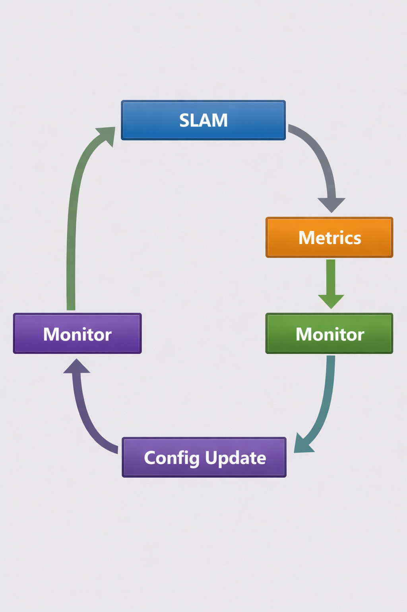

# GSoC Proposal: Improving Robustness of Kornia-SLAM for Real-World Visual-Inertial Deployment with Bubbaloop Integration

**Organization:** Kornia  
**Project Size:** Large (~350 hours)  
**Difficulty:** Hard  

---

## Executive Summary

This project focuses on transforming kornia-slam from a working visual odometry pipeline into a **robust, real-world deployable SLAM system**.

Instead of introducing new algorithms, the project targets the primary gap in modern SLAM systems: **failure under real-world conditions** such as motion blur, lighting changes, dynamic objects, and tracking loss.

The core contributions are:

1. **Robust tracking pipeline**
   - Adaptive preprocessing (CLAHE, blur detection)
   - Improved matching and outlier rejection
   - Dynamic parameter tuning

2. **Failure recovery system**
   - Explicit LOST state
   - BoW-based relocalization
   - Seamless recovery without map reset

3. **Adaptive runtime monitoring**
   - Real-time health metrics
   - Automatic parameter adjustment

4. **Real-world deployment via Bubbaloop**
   - SLAM node with live pose streaming
   - MCP-based spatial querying
   - Autonomous indoor mapping agent

The system will be evaluated on TUM, EuRoC, and TUM-VI datasets with measurable improvements in tracking success, relocalization, and robustness.

---

## System Overview


## Table of Contents

1. [Introduction](#1-introduction)
2. [About Me](#2-about-me)
3. [Problem Statement](#3-problem-statement)
4. [Current System Understanding](#4-current-system-understanding)
5. [Proposed Work](#5-proposed-work)
   - [5.1 Robust Preprocessing](#51-robust-preprocessing)
   - [5.2 Tracking Robustness](#52-tracking-robustness)
   - [5.3 Keyframe & Map Management](#53-keyframe--map-management)
   - [5.4 Failure Recovery](#54-failure-recovery)
   - [5.5 Optimization Hardening](#55-optimization-hardening-stretch-goal)
   - [5.6 IMU-Ready Architecture](#56-imu-ready-architecture)
   - [5.7 Adaptive Runtime Monitoring and Parameter Adjustment](#57-adaptive-runtime-monitoring-and-parameter-adjustment)
6. [Bubbaloop Application: Autonomous Indoor Mapping Agent](#6-bubbaloop-application-autonomous-indoor-mapping-agent)
7. [Evaluation Plan](#7-evaluation-plan)
8. [Timeline](#8-timeline)
9. [Contributions](#9-contributions)
10. [Risks and Mitigation](#10-risks-and-mitigation)
11. [Prior Contributions and Why Me](#11-prior-contributions-and-why-me)

---

## 1. Introduction

kornia-slam is a Rust-native visual-inertial SLAM system built on top of kornia-rs, providing a complete pipeline including feature extraction, pose estimation, mapping, and bundle adjustment. The develop branch already contains a functional visual odometry system, with IMU preintegration actively being added.

**The problem is not that the pipeline doesn't exist. The problem is that it will break in the real world.**

Modern SLAM systems consistently face the same gap: algorithms that work reliably on clean benchmarks degrade under real-world conditions such as lighting variation, motion blur, dynamic scenes, repetitive textures, and tracking loss. Bridging this gap—turning a working pipeline into a *reliable system*—is what separates research prototypes from deployable software. As emphasized in SLAM literature, robustness engineering is where the majority of effort lies in production systems.

This proposal focuses entirely on that robustness gap.  
**The core deliverables are Sections 5.1–5.4** (preprocessing, tracking, keyframe management, and failure recovery), while **Sections 5.5 and 5.7 are stretch goals**.

The project will deliver:

1. **Robustness modules for kornia-slam**  
   Adaptive preprocessing, improved matching, outlier rejection, keyframe management, and relocalization—each targeting a specific real-world failure mode.

2. **Adaptive runtime monitoring**  
   A lightweight, rule-based system that detects degraded performance (e.g., low inlier ratio, high BA residuals) and dynamically adjusts pipeline parameters without human intervention.

3. **A Bubbaloop application**  
   An autonomous indoor mapping agent demonstrating the improved SLAM system, with MCP-based map serving for querying pose, landmarks, and spatial relationships.

4. **Quantitative validation**  
   Before/after benchmarks on EuRoC and TUM-VI measuring tracking success rate, relocalization performance, and drift, along with a complete system demo.

The goal is to transform kornia-slam from a functioning pipeline into a system capable of **sustained, reliable operation in real-world environments**.

## 2. About Me

> **Name:** Arkin Kansra
> **University:** GGSIPU, Delhi, India
> **Program / Semester:** B.Tech CSE (AI), 4th Semester
> **Email:** arkinkansra@gmail.com
> **GitHub:** https://github.com/arc-wonders
> **Timezone:** IST (UTC+5:30)
> **LinkedIn:** https://www.linkedin.com/in/arkin-kansra/

I am a computer science student focused on computer vision, robotics perception, and systems programming in Rust. I have contributed to both the Python (kornia) and Rust (kornia-rs) sides of the Kornia ecosystem, and built an experimental visual odometry pipeline (Rusty SLAM) that gave me firsthand experience with the exact failure modes this proposal addresses - drift under fast rotation, tracking loss in low-texture regions, and feature matching instability under lighting changes.

---

## 3. Problem Statement

A visual SLAM pipeline that performs tracking → mapping → bundle adjustment exhibits a well-defined set of failure modes when deployed in real-world environments.

These failures are not algorithmic errors, but **robustness gaps**—implicit assumptions that hold on clean benchmark data but break under real conditions such as lighting variation, motion blur, dynamic objects, and ambiguous geometry. As a result, even a technically correct pipeline can degrade rapidly or fail entirely.

### Failure Mode Analysis

| Failure Mode | Root Cause | Impact | Frequency |
|---|---|---|---|
| **Feature starvation** | Fixed FAST threshold fails in low-light or overexposed regions | Tracking loss due to insufficient 2D–3D correspondences | Common in indoor scenes with mixed lighting |
| **Motion blur corruption** | Camera motion during exposure degrades feature localization and descriptors | False matches → incorrect pose → map corruption | Fast motion (handheld, head movement, robots) |
| **Brute-force matching bottleneck** | O(n²) descriptor matching without spatial constraints | Increased latency and incorrect matches in repetitive textures | Structured environments (corridors, shelves, tiles) |
| **Drift accumulation** | Frame-to-frame pose estimation without strong temporal consistency | Gradual trajectory drift and map inconsistency | Always present, accumulates over time |
| **Dynamic object contamination** | Non-static objects introduce inconsistent observations into the map | Persistent outliers → degraded bundle adjustment → map corruption | Any populated or dynamic environment |
| **Tracking loss without recovery** | Absence of relocalization mechanism | Complete system failure requiring manual restart | Occlusion, rapid motion, scene change |
| **Keyframe redundancy** | No redundancy-aware culling strategy | Memory growth and increasing BA cost over time | Long-running sequences |
| **Initialization fragility** | Two-view geometry fails under low parallax or pure rotation | System remains stuck in initialization | Slow motion or constrained setups |

These failure modes are consistently observed in standard benchmarks such as EuRoC `V203` (aggressive motion and lighting variation), TUM-VI corridor sequences (low texture with IMU), and TUM `fr3/nostructure_texture_near_withloop` (texture-poor scenes).

A robust SLAM system must handle these conditions **without manual intervention or parameter retuning**.

**This proposal addresses each failure mode with a corresponding, testable system-level improvement.**

---

## 4. Current System Understanding

### 4.1 kornia-rs — Existing Capabilities

kornia-rs already provides a comprehensive set of vision and optimization primitives required for building a SLAM system. These include:

- **Feature extraction:** ORB detector with scale pyramids, FAST-based keypoint detection, and binary descriptors
- **Feature matching:** Hamming-based matching with ratio tests and orientation consistency
- **Pose estimation:** Two-view geometry (fundamental/homography selection), EPnP with RANSAC, and triangulation
- **Optimization:** A generic Levenberg–Marquardt solver with support for SE(3) manifolds and robust loss functions (Huber, Cauchy)
- **Place recognition:** Bag-of-Words vocabulary tree with multiple similarity metrics and direct indexing
- **Lie group operations:** Full SE(3), SO(3), and related transformations for geometric optimization

These components collectively provide all the building blocks required for a modern visual SLAM pipeline.

---

### 4.2 kornia-slam — Current Pipeline

The `develop` branch of kornia-slam already implements a working visual odometry system with mapping and local bundle adjustment. IMU preintegration is being actively added by the maintainer, forming the basis of a visual-inertial pipeline.

**This proposal does not aim to build these components. It assumes they exist and focuses on making them robust.**

#### 4.2.1 Current Capabilities

The current system includes:

- **State machine:** Bootstrap → Tracking (no explicit LOST state)
- **Motion model:** Constant velocity prediction used as PnP initialization
- **Tracking pipeline:** Projection-guided matching → PnP → local refinement
- **Guided matching:** Spatially constrained matching using projected map points with fallback strategies
- **Map point management:** Visibility-based tracking and basic culling using observation ratios
- **Local bundle adjustment:** Optimization over recent keyframes with older frames fixed
- **Keyframe insertion:** Based on frame spacing and inlier ratios
- **Map growth:** Triangulation from keyframe pairs
- **Local map selection:** Covisibility-based neighborhood construction

These components together form a functional SLAM pipeline capable of running on standard datasets.

---

### 4.2.2 Identified Robustness Gaps

Despite having a complete pipeline, several critical robustness components are missing:

| Gap | Current Behavior | Impact |
|---|---|---|
| **No preprocessing** | Raw images fed directly to ORB | Feature starvation under challenging lighting |
| **No adaptive feature extraction** | Fixed FAST thresholds | Poor spatial coverage in low-contrast regions |
| **No statistical outlier rejection** | Only RANSAC filtering | Dynamic or incorrect matches persist in map |
| **No relocalization** | Tracking failure triggers reset | Loss of accumulated map and trajectory |
| **No explicit LOST state** | Binary Bootstrap/Tracking | No recovery attempt before reset |
| **No keyframe culling** | Keyframes grow unbounded | Increased memory and optimization cost |
| **No adaptive tuning** | Fixed parameters | Silent degradation under changing conditions |
| **No evaluation framework** | No systematic benchmarking | No measurable way to validate improvements |

These gaps are not architectural limitations, but **missing robustness layers** on top of an already functional system.

---

### 4.3 Bubbaloop — Deployment Runtime

Bubbaloop provides a mature runtime environment for deploying the SLAM system, including:

- Zenoh-based pub/sub communication
- Node SDK for modular system design
- MCP server for tool-based interaction
- Multi-agent runtime with structured memory layers
- Web-based dashboard for visualization and monitoring

This enables the SLAM system to operate as part of a larger agent-driven application, rather than as a standalone pipeline.

---
## 5. Proposed Work

All improvements build on top of the existing kornia-slam pipeline. Each subsection identifies a specific failure mode, the proposed fix, the concrete implementation, and how to verify it works. All thresholds and parameter values given below are initial heuristics derived from ORB-SLAM2/3 defaults and SLAM literature; they will be empirically tuned across datasets during evaluation.

### 5.1 Robust Preprocessing

**Problem:** The ORB detector uses fixed FAST thresholds globally. In scenes with mixed lighting (window + dark corner), bright regions produce thousands of features while dark regions produce zero. The tracker starves for correspondences in under-exposed areas, causing tracking loss. Additionally, motion blur during fast camera motion smears features, making descriptors unreliable.

**Fix A - CLAHE (Contrast Limited Adaptive Histogram Equalization):**

Add a CLAHE implementation to kornia-imgproc as a preprocessing step before feature extraction:

```rust
pub struct ClaheParams {
    pub clip_limit: f32,       // 3.0 - contrast amplification ceiling
    pub tile_size: [usize; 2], // [8, 8] - grid of contextual regions
}

pub fn apply_clahe<A: ImageAllocator>(
    src: &Image<f32, 1, A>,
    params: &ClaheParams,
) -> Result<Image<f32, 1, CpuAllocator>, ImageError>
```

The image is divided into `tile_size` tiles. Each tile computes a local histogram, clips bins exceeding `clip_limit * (tile_pixels / num_bins)`, redistributes clipped counts uniformly, and builds a CDF. Final pixel values interpolate between neighboring tile CDFs using bilinear weights. This normalizes local contrast without amplifying noise.

**Verification:** Run ORB extraction on TUM `fr2/desk` frame 847 (half the frame in shadow). Count features in the dark quadrant before/after CLAHE. Target: substantial increase in under-exposed region features (expecting ~4x based on OpenCV CLAHE benchmarks).

**Fix B - Motion Blur Detection:**

Compute the variance of the Laplacian over the frame:

$$\sigma^2_{\nabla^2} = \text{Var}(\nabla^2 I)$$

If $\sigma^2_{\nabla^2}$ falls below a threshold (empirically ~100 for 640x480 grayscale), the frame is flagged as blurred. The tracker responds by:
1. Increasing the PnP RANSAC reprojection threshold from 8px to 12px (blurred features have position uncertainty)
2. Relaxing the Lowe's ratio test from 0.6 to 0.75 (descriptors are noisier)
3. Requiring more RANSAC iterations (200 instead of 100)

**Verification:** Track EuRoC `V201` (fast MAV motion). Measure tracking loss rate with/without blur adaptation. Target: significant reduction in tracking failures during fast rotation (expecting ~20–40% based on similar systems).

**Fix C - Adaptive FAST Threshold Per Cell:**

Replace the global two-tier FAST threshold with per-cell adaptation. For each grid cell, start at `ini_fast_threshold` and iteratively lower toward `min_fast_threshold` until the cell contains at least `target_per_cell` features (target = `n_keypoints / num_cells`). This ensures spatial coverage regardless of local contrast.

```rust
fn detect_cell_adaptive(
    &self,
    cell: &Image<f32, 1, A>,
    target_count: usize,
) -> Vec<Keypoint> {
    let mut threshold = self.ini_fast_threshold;
    loop {
        let kps = fast_detect(cell, threshold);
        if kps.len() >= target_count || threshold <= self.min_fast_threshold {
            return kps;
        }
        threshold *= 0.7; // step down by 30%
    }
}
```

**Verification:** Run on TUM `fr3/nostructure_texture_near_withloop` (featureless surfaces interspersed with textured regions). Compare feature spatial distribution uniformity before/after.

### 5.2 Tracking Robustness


**Problem:** The current pipeline already includes projection-based matching (with `KeypointGrid` spatial index and narrow-to-wide search radius fallback), constant velocity motion prediction, and basic map point filtering via `found_ratio`. However, these components lack statistical outlier rejection, adaptive behavior under degraded conditions, and robustness to dynamic or low-quality observations. Specifically: there is no chi-square test after PnP to catch individual bad correspondences, no mechanism to detect and respond to prediction failures (e.g., scene changes), and the matching search radius is fixed rather than condition-aware.

**Fix A - Motion Prediction Monitoring:**

The existing `state.velocity` already provides a constant velocity pose prediction. This proposal adds **prediction error monitoring**: after PnP estimation, compute the discrepancy between the predicted and estimated pose in the tangent space:

$$\|\Delta \boldsymbol{\xi}\|_2 = \|\log(\hat{\mathbf{T}}_k^{-1} \cdot \mathbf{T}_k)\|$$

When this exceeds a threshold (rotation > 0.1 rad or translation > 0.5m), flag the frame as a potential scene change and widen the guided matching search radius from 15px to 30px (leveraging the existing narrow-to-wide mechanism in `MapProjectionEstimator`). This makes the existing motion model failure-aware.

**Fix B - Improve Existing Guided Matching with Adaptive Search Radius:**

The current `ProjectionMatchConfig` uses a fixed `search_radius=15.0` with a hardcoded 2x fallback. This proposal replaces the fixed fallback with **condition-dependent radius scaling**:

- During normal tracking: 15px (unchanged)
- When motion prediction error is elevated: scale radius proportional to prediction error magnitude
- After relocalization recovery: 30px for 10 frames, then taper back to 15px
- Under blur detection (Section 5.1): increase radius by 1.5x to accommodate position uncertainty

This builds on the existing `KeypointGrid::query_radius()` and `ProjectionMatchConfig` - no new spatial index is needed, only smarter radius selection.

This approach aligns with the core tracking strategy in ORB-SLAM2/3, where pose prediction and spatial priors are the primary drivers of robustness rather than descriptor-only matching.

**Verification:** Compare tracking success rate on EuRoC `V203` (aggressive motion) with fixed radius vs. adaptive radius. Target: measurable improvement in frames successfully tracked during high-motion segments.

**Fix C - Chi-Square Outlier Rejection:**

After PnP estimation, test each 2D-3D correspondence against the chi-square distribution:

$$e_i^2 = \|\mathbf{u}_i - \pi(\mathbf{T} \cdot \mathbf{p}_i)\|^2$$

For a 2-DOF reprojection error, the 95% chi-square threshold is $\chi^2_{2, 0.05} = 5.991$. Points with $e_i^2 / \sigma^2 > 5.991$ are classified as outliers (where $\sigma$ is the scale-dependent observation noise, typically 1px at pyramid level 0, scaled by $1.2^{\text{level}}$).

Outlier points accumulate a `bad_observation_count`. Points where `bad_observations / total_observations > 0.25` are culled from the map - they likely correspond to moving objects or incorrect triangulations.

**Fix D - Enhanced Map Point Quality Filtering:**

The existing `Map::cull()` already tracks `n_visible`/`n_found` per map point and culls at `found_ratio < 0.20` after 5 observations. This proposal tightens the quality filter in two ways:

1. **Observation maturity threshold:** Increase the minimum observation count before culling decisions from 5 to 25 frames. This prevents premature culling of recently triangulated points while giving genuinely bad points enough history to reveal themselves.
2. **Dynamic object detection via `bad_observation_count`:** Integrate the chi-square outlier results (Fix C) into the map point quality model. Points that repeatedly fail the chi-square test accumulate a `bad_observation_count`. Points where `bad_observations / total_observations > 0.25` are culled regardless of found ratio - these are typically points on moving objects whose position changes between frames.

**Verification:** Run TUM `fr2/desk_with_person` (dynamic scene with person walking). Compare map point count and ATE with the existing culling vs. enhanced filtering. Target: significant reduction in phantom map points from moving objects, measurable ATE improvement.

### 5.3 Keyframe & Map Management

**Problem:** The existing `KeyframePolicy` inserts keyframes based on frame gap (`min=3`, `max=8`) and inlier ratio relative to the reference keyframe. This works for basic tracking but lacks geometric diversity awareness - it doesn't consider feature overlap, temporal spacing, or triangulation opportunity. More critically, there is **no keyframe culling at all**: keyframes accumulate indefinitely, causing memory growth and BA slowdown in long sessions.

**Fix A - Extend Keyframe Insertion with Geometric Criteria:**

Augment the existing `KeyframePolicy::should_insert()` with additional conditions. A frame becomes a keyframe when the existing frame-gap and inlier-ratio checks pass AND:
1. **Feature overlap** with the last keyframe drops below 70% (fraction of current tracked points also tracked in the last keyframe)
2. **Sufficient unmatched features**: at least 100 keypoints in the current frame have no corresponding map point (opportunity for new triangulations)

These additions are implemented by extending the existing `KeyframePolicy` struct, not replacing it:

```rust
pub struct KeyframePolicy {
    // existing fields
    pub min_frames_between: usize,
    pub max_frames_between: usize,
    pub ref_ratio: f64,
    // new geometric criteria
    pub max_feature_overlap: f32,      // 0.7
    pub min_unmatched_features: usize, // 100
}
```

**Fix B - Redundant Keyframe Culling:**

After each local BA, check all keyframes in the covisibility window. A keyframe is redundant if 90% or more of its map points are observed by at least 3 other keyframes at the same or finer pyramid level. Redundant keyframes are removed from the map:
1. Remove the keyframe from the covisibility graph
2. Re-parent its map point observations to remaining keyframes
3. Update covisibility edges

The first keyframe (origin) and the two most recent keyframes are never culled.

**Verification:** Run TUM `fr1/room` (360° loop, ~1500 frames). Compare keyframe count and BA time with/without culling. Target: significant keyframe reduction (~20–40% expected), proportional BA speedup, no ATE degradation.

### 5.4 Failure Recovery


**Problem:** When tracking fails, the current pipeline increments `consecutive_failures` and after 15 failures calls `state.reset()`, which transitions back to `Bootstrap` mode. While the `Map` object is not explicitly cleared, the system restarts bootstrapping from scratch with no mechanism to reconnect to the existing map. There is no LOST state, no relocalization attempt, and no way to recover the mapping progress. A momentary occlusion or fast head turn effectively abandons minutes of accumulated mapping work.

**Fix A - Tracking Loss Detection and LOST State:**

Replace the binary Bootstrap/Tracking state machine with a three-state model: `Bootstrap` → `Tracking` → `LOST` → `Tracking` (or `LOST` → `Bootstrap` as a last resort).

Define explicit tracking loss criteria (replacing the current simple failure counter):
- PnP RANSAC inlier count < 15 for 3 consecutive frames
- Average reprojection error > 4px for 3 consecutive frames
- Motion model prediction error > 30° rotation or > 2m translation

When triggered, the tracking state transitions to `LOST`. The map is **preserved**. All incoming frames are processed for relocalization attempts instead of normal tracking.

**Fix B - BoW-Based Relocalization:**

When in `LOST` state:

1. Extract ORB features from the current frame and compute its BoW vector via `Vocabulary::transform`
2. Query all keyframes using `BoW::l1_similarity`. Rank by score, keep top-K candidates (K=5) exceeding a minimum similarity threshold (0.01)
3. For each candidate keyframe, perform guided feature matching using the `DirectIndex` (only compare features sharing the same vocabulary node)
4. Run EPnP+RANSAC on the matched 2D-3D correspondences (2D from current frame, 3D from candidate keyframe's map points). Use tighter parameters: `max_iterations=300`, `reproj_threshold_px=5.0`
5. Accept relocalization if inlier count ≥ 30 and reprojection RMSE < 3px
6. On success: set pose, transition to `TRACKING`, run a local BA on the recovery keyframe + its covisible neighborhood to re-anchor the trajectory

**Gradual recovery:** For 10 frames after relocalization, use a wider search radius (30px instead of 15px) for guided matching to accommodate residual pose error.

If relocalization fails after a configurable number of attempts (default: 30 frames in LOST state), the system falls back to reinitialization while preserving the previous map for later merging if a place recognition match is found.

**Verification:** On TUM `fr1/desk`, artificially skip 50 frames (simulating occlusion), then resume. Measure: (a) does relocalization succeed? (b) time to recover? (c) ATE after recovery vs. continuous tracking. Target: >80% relocalization success rate, <2 second recovery time.

### 5.5 Optimization Hardening (Stretch Goal)

> **Note:** This section is a stretch goal. The core robustness work (5.1–5.4) does not depend on it. It is included because BA scalability will become a bottleneck in longer sessions, but it will only be pursued if the core work is complete and stable.

**Problem:** The existing LM solver in kornia-algebra builds dense $J^T J$ matrices. For bundle adjustment with hundreds of keyframes and thousands of map points, this is both memory-prohibitive and numerically fragile. Additionally, BA without gauge fixing can drift in the null space.

**Fix A - Prototype BA-Specific Schur Complement:**

BA has a bipartite sparsity pattern: pose variables connect to point variables through reprojection factors, but poses don't connect to each other and points don't connect to each other. The Schur complement exploits this by eliminating point variables first:

$$(\mathbf{H}_{pp} - \mathbf{H}_{pl} \mathbf{H}_{ll}^{-1} \mathbf{H}_{lp}) \delta_p = \mathbf{b}_p - \mathbf{H}_{pl} \mathbf{H}_{ll}^{-1} \mathbf{b}_l$$

Where $\mathbf{H}_{ll}$ is block-diagonal (each point's 3x3 block is independent), so its inverse is trivial. This reduces the system from $(6N_p + 3N_l) \times (6N_p + 3N_l)$ to $6N_p \times 6N_p$.

The goal is to prototype a `SchurLinearSystemBuilder` and evaluate its integration feasibility with kornia-algebra's generic solver architecture. Since kornia-algebra is intentionally generic, adding a BA-specific path is a design decision that requires mentor alignment - the prototype will be developed behind a feature flag and benchmarked before proposing upstream integration.

**Fix B - Gauge Fixing:**

Fix the first keyframe's pose as constant (do not include it in the optimization variables) to anchor the coordinate frame. This prevents the optimizer from drifting in the 7-DOF gauge freedom (6 for SE(3) + 1 for monocular scale). This is a small, low-risk change regardless of whether the Schur complement is merged.

**Verification:** Compare BA convergence time and memory usage on a 100-keyframe/5000-point problem with/without Schur complement. Target: measurable speedup and memory reduction (expecting ~5x and ~10x respectively based on SLAM literature).

### 5.6 IMU-Ready Architecture

The maintainer is actively adding IMU preintegration to kornia-slam's develop branch. This proposal does not implement IMU integration itself, but ensures that all robustness work is compatible with the VIO backend and provides architectural support:

- **Timestamp-based frame management:** All keyframes and map points carry acquisition timestamps, enabling asynchronous sensor fusion with IMU measurements at higher rates (200–400 Hz IMU vs. 20–30 Hz camera)
- **Factor graph extensibility:** The `Factor` trait in kornia-algebra already supports arbitrary residual/Jacobian definitions. A `PreintegrationFactor` connecting consecutive keyframe poses can be added without modifying the optimizer. The robust losses (Huber, Cauchy) work identically whether the factor graph contains only reprojection factors or a mix of reprojection + preintegration factors
- **Variable type support:** SE3 and Euclidean variable types are already implemented. IMU bias variables (Euclidean(6) for accel + gyro bias) slot in directly via `VariableType::Euclidean(6)`
- **Velocity state compatibility:** If the VIO backend maintains a velocity state alongside the pose, the motion model (Section 5.2 Fix A) can use IMU-propagated velocity instead of constant-velocity assumption - a strictly better prediction that will improve guided matching (Section 5.2 Fix B) during fast motion

**Verification:** When IMU preintegration lands in develop, run the robustness test suite on TUM-VI sequences (which include synchronized IMU data) to confirm no regressions. Specifically, test that keyframe management (5.3) and relocalization (5.4) handle the tighter inter-keyframe constraints introduced by preintegration factors.

### 5.7 Adaptive Runtime Monitoring and Parameter Adjustment

**Problem:** Traditional SLAM systems use fixed parameters tuned for average conditions. When conditions change (entering a dark corridor, passing through a texture-less hallway, encountering fast motion), the fixed configuration degrades silently until tracking fails. A human operator must notice the failure and restart.

**Concept:** Instead of fixed parameters, the SLAM pipeline exposes runtime observables and accepts runtime reconfiguration. A lightweight, deterministic monitor (rule-based, no ML) watches these observables and adjusts pipeline parameters in real-time. This design is compatible with future agent-based extensions via Bubbaloop's MCP tools.

**Observable Metrics (exposed by the SLAM pipeline):**

| Observable | Source | What It Indicates |
|---|---|---|
| Feature count per frame | ORB detector output | Feature starvation risk |
| Inlier ratio after PnP RANSAC | Tracking module | Matching quality degradation |
| Mean reprojection error | BA residuals | Map/pose inconsistency |
| BA convergence iterations | LM solver | Optimization difficulty |
| Tracking quality score | PnP output (inliers / total matches) | Overall tracking health |
| BoW similarity to last keyframe | Place recognition | Scene change detection |

**Adaptive Responses:**

| Condition | Detection Rule | Response |
|---|---|---|
| Feature starvation | `feature_count < 0.5 * target_keypoints` for 3 frames | Lower FAST threshold floor from 7 → 3, increase CLAHE clip_limit from 3.0 → 5.0 |
| Degraded matching | `inlier_ratio < 0.4` for 5 frames | Widen guided matching search radius from 15px → 25px, relax Lowe's ratio from 0.6 → 0.7 |
| High BA residuals | `mean_reproj_error > 3px` after BA | Increase Cauchy loss kernel from σ=1.0 → σ=2.0, add extra LM iterations |
| Fast motion detected | `motion_model_velocity > threshold` | Relax RANSAC reprojection threshold, increase RANSAC iterations |
| Near tracking loss | `tracking_quality < 0.3` for 3 frames | Pre-compute BoW vector for current frame (warm relocalization cache) |

**Implementation:**

```rust
pub struct SlamMonitor {
    config: SlamConfig,              // mutable pipeline config
    history: VecDeque<FrameStats>,   // sliding window of observables
    window_size: usize,              // default: 5 frames
}

impl SlamMonitor {
    /// Called after each frame. Returns config changes if adaptation is needed.
    pub fn update(&mut self, stats: &FrameStats) -> Option<ConfigDelta> {
        self.history.push_back(stats.clone());
        if self.history.len() > self.window_size {
            self.history.pop_front();
        }
        self.evaluate_rules()
    }

    fn evaluate_rules(&self) -> Option<ConfigDelta> {
        let mut delta = ConfigDelta::default();
        let avg_features = self.history.iter().map(|s| s.feature_count).sum::<usize>()
            / self.history.len();
        if avg_features < self.config.target_keypoints / 2 {
            delta.fast_threshold_min = Some(3);
            delta.clahe_clip_limit = Some(5.0);
        }
        // ... additional rules
        if delta.has_changes() { Some(delta) } else { None }
    }
}
```

This is not machine learning - it is a deterministic state machine with clearly defined transitions. The same observables and `ConfigDelta` API are exposed via MCP tools in the Bubbaloop application (Section 6), enabling higher-level agent reasoning about when and how to adapt.

**Verification:** Run EuRoC `V203` (starts easy, becomes aggressive motion). Compare tracking success rate with fixed config vs. adaptive monitoring. Target: measurable improvement in tracking success rate during the aggressive segment without degrading the easy segment.

### Trade-offs

Some robustness improvements (e.g., stricter outlier rejection or adaptive thresholds) may introduce trade-offs between stability and sensitivity; these will be evaluated carefully to avoid degrading performance on easier sequences. Every change is benchmarked on both challenging *and* easy sequences to ensure no regressions.

---

## 6. Bubbaloop Application: Autonomous Indoor Mapping Agent

### Concept

A Bubbaloop node running the improved SLAM pipeline on a camera-equipped device. An AI agent queries spatial state via MCP tools, monitors tracking health, detects environment changes against a stored reference map, and responds to natural language spatial queries. This application depends directly on the robustness work in Section 5: CLAHE and guided matching for typical office lighting, relocalization for occlusion recovery, and keyframe culling for long-running sessions.

### Architecture

```
Camera Node → [Zenoh: .../camera/image] → SLAM Node → [Zenoh: .../slam/pose, .../slam/status]
                                                            ↓
                                                    Context Provider
                                                            ↓
                                                     World State (Tier 0)
                                                            ↓
                                                    Mapping Agent (LLM)
                                                            ↓
                                                  MCP Tools / Dashboard
```

### SLAM Node (Bubbaloop Integration)

Implemented as a standard Bubbaloop node via the Node SDK:

```rust
#[async_trait]
impl Node for SlamNode {
    type Config = SlamConfig;
    fn name() -> &'static str { "slam" }
    fn descriptor() -> &'static [u8] { include_bytes!("slam.descriptor.bin") }

    async fn run(self, ctx: NodeContext) -> Result<()> {
        let camera_sub = ctx.session.declare_subscriber(
            ctx.topic(&self.config.camera_topic)
        ).await?;
        let pose_pub = ctx.session.declare_publisher(ctx.topic("slam/pose")).await?;
        let status_pub = ctx.session.declare_publisher(ctx.topic("slam/status")).await?;

        loop {
            tokio::select! {
                sample = camera_sub.recv_async() => {
                    let frame = decode_image(&sample?);
                    let result = self.pipeline.process_frame(&frame);
                    pose_pub.put(result.pose.encode()).await?;
                    if result.state_changed {
                        status_pub.put(result.status.encode()).await?;
                    }
                }
                _ = ctx.shutdown_rx.changed() => break,
            }
        }
        Ok(())
    }
}
```

**Published topics:**

| Topic Suffix | Rate | Content |
|---|---|---|
| `slam/pose` | 30 Hz | SE3 (quat + translation) + tracking quality (0.0–1.0) + state enum |
| `slam/status` | On change | State, keyframe count, map point count, FPS, relocalization events |
| `slam/map` | 1 Hz | Compressed sparse point cloud for visualization |

**Command queryable:** `reset`, `save_map`, `load_map`, `set_mode` (SLAM ↔ localization-only), `get_trajectory`

### Agent Integration

A context provider rule writes SLAM output into Tier-0 world state:

```yaml
topic_pattern: "bubbaloop/**/slam/status"
world_state_key_template: "robot.slam.{field}"
```

This gives the agent access to `robot.slam.state` (TRACKING/LOST/INITIALIZING), `robot.slam.keyframe_count`, `robot.slam.tracking_quality` without LLM latency.

An alert triggers agent attention on tracking failure:
```
register_alert(predicate: "robot.slam.state == 'LOST'", arousal_boost: 0.8)
```

**MCP tools** for spatial querying and SLAM control:

*Spatial Query Tools (map serving for agent reasoning):*
- `get_slam_pose` - current 6-DOF pose + tracking quality score
- `get_slam_status` - health metrics, state, keyframe/map point counts
- `get_nearby_landmarks` - query map points within radius of current pose
- `get_spatial_relationships` - covisibility between keyframes, relative poses between named locations
- `query_map_region` - map points and keyframes within a 3D bounding box

*Management Tools:*
- `save_slam_map` / `load_slam_map` - persistence
- `compare_map_snapshot` - diff current map against stored reference, return changed regions
- `reconfigure_slam` - push `ConfigDelta` to the runtime monitor (Section 5.7)

These tools enable MCP-based map serving: an agent can query spatial state, detect environment changes, and adjust SLAM parameters through the same interface used by all Bubbaloop tools.

### Use Case Walkthrough

1. **Morning setup:** `bubbaloop up` with `skills/mapping.yaml`. Camera node + SLAM node start. Agent initializes.
2. **Initial mapping:** User walks through the office. SLAM builds a map. CLAHE handles the dark hallway. Guided matching handles the glass-walled conference room (reflections). Agent logs: "Initial map complete, hundreds of keyframes and thousands of map points."
3. **Dark corridor adaptation:** Runtime monitor detects feature starvation, auto-adjusts FAST threshold and CLAHE clip limit. Agent logs the adaptation.
4. **Afternoon re-entry:** SLAM loads morning's map in localization-only mode. Agent detects furniture changes via `compare_map_snapshot`.
5. **Occlusion recovery:** SLAM enters LOST state → agent receives alert → relocalization fires → tracking resumes.
6. **Spatial query:** "What's near the entrance?" → agent calls `get_nearby_landmarks`, cross-references episodic memory, responds.
7. **Dashboard:** 3D trajectory, point cloud, tracking status, adaptation log.

---

## 7. Evaluation Plan

### Primary Metrics

All metrics are measured **before and after** applying robustness improvements to the kornia-slam baseline on the same sequences.

| Metric | Definition | How Measured |
|---|---|---|
| **Tracking Success Rate** | % frames with valid pose (PnP inliers ≥ 15) | `valid_frames / total_frames * 100` per sequence |
| **ATE RMSE** | Absolute trajectory error (Sturm et al., 2012) after SE(3) alignment | Standard `evaluate_ate.py` script against ground truth |
| **Relocalization Success Rate** | % of artificial tracking losses that are recovered | Skip N frames, attempt reloc, measure success over 50 trials |
| **Relocalization Latency** | Time from LOST state entry to successful pose recovery | Wall-clock average over successful relocalization events |
| **Map Efficiency** | Keyframes / trajectory length | Lower = better keyframe culling |
| **Tracking Throughput** | Milliseconds per frame | Measured end-to-end including preprocessing |

### Test Sequences

| Sequence | Challenge | What It Tests |
|---|---|---|
| TUM `fr1/desk` | Baseline indoor | Core tracking accuracy (ATE target: < 5 cm) |
| TUM `fr1/room` | 360° loop | Loop closure + keyframe culling |
| TUM `fr2/desk_with_person` | Dynamic objects | Feature lifetime + outlier rejection |
| TUM `fr3/nostructure_texture_near_withloop` | Low texture | Adaptive threshold + CLAHE |
| EuRoC `MH01` | Baseline MAV flight | Core accuracy on aerial platform |
| EuRoC `V201` | Fast motion + poor lighting | Motion blur detection + adaptive matching |
| EuRoC `V203` | Aggressive motion | Tracking under extreme conditions + adaptive monitoring |
| TUM-VI `corridor4` | Long corridor, low texture, IMU | VIO robustness in featureless environments |
| TUM-VI `room4` | Indoor with IMU | Visual-inertial tracking accuracy |
| TUM-VI `slides3` | Fast motion with IMU | IMU-aided recovery from visual degradation |

### Success Criteria

The project succeeds if:
1. Tracking success rate improves measurably on challenging sequences (V203, fr2/desk_with_person, TUM-VI corridor) vs. baseline - targeting significant improvement (~15%+ based on similar systems)
2. Relocalization works with >80% success rate within 2 seconds
3. ATE does not degrade on easy sequences (fr1/desk, MH01) - robustness must not hurt accuracy
4. Adaptive monitoring shows measurable tracking improvement on sequences with varying difficulty (V203) vs. fixed-config baseline
5. The Bubbaloop application runs a continuous 10-minute live session without manual intervention
6. Published benchmark results and a video demo of the complete system

---

## 8. Timeline

### Pre-GSoC (Now → May)
- Contribute to kornia-slam's `develop` branch as it develops - fix bugs, add tests, understand the pipeline internals
- Build a benchmark harness that runs kornia-slam on TUM `fr1/desk` and EuRoC `MH01` and reports ATE + tracking success rate
- Familiarize with TUM-VI dataset format (synchronized stereo + IMU) for later VIO evaluation
- This ensures familiarity with the code and establishes the baseline numbers

### Phase 1: Robust Preprocessing (Weeks 1–3, ~60 hours)

| Week | Focus | Deliverable | Verification |
|---|---|---|---|
| 1 | CLAHE in kornia-imgproc | `apply_clahe()` with tile-based local histogram equalization and bilinear interpolation. Unit tests + visual comparison. | Substantial feature count increase in dark regions |
| 2 | Blur detection + adaptive FAST | Laplacian variance blur metric. Per-cell adaptive FAST threshold loop. | Track EuRoC V201 - fewer tracking losses during fast rotation |
| 3 | Integration + preprocessing pipeline | Wire CLAHE → adaptive ORB into kornia-slam's tracking loop. Benchmark: before/after on TUM fr3/nostructure. | Tracking success rate improvement on low-texture sequences |

### Phase 2: Tracking Hardening (Weeks 4–7, ~80 hours)

| Week | Focus | Deliverable | Verification |
|---|---|---|---|
| 4 | Motion prediction monitoring + adaptive search radius | Prediction error computation, condition-dependent radius scaling for existing `ProjectionMatchConfig`. Integration with blur detection flag. | Improved tracking on V203 high-motion segments |
| 5 | Chi-square outlier rejection | Per-point reprojection error test ($\chi^2_{2,0.05}=5.991$). `bad_observation_count` integration with existing `MapPoint` quality tracking. | Significant phantom point reduction on fr2/desk_with_person |
| 6 | Enhanced map point quality filtering | Tightened culling criteria (maturity threshold, dynamic object detection via chi-square). Integration with existing `Map::cull()`. | Cleaner maps on dynamic sequences |
| 7 | Extended keyframe insertion + redundant keyframe culling | Geometric criteria added to existing `KeyframePolicy`. 90%-redundancy culling after local BA. | Measurable keyframe reduction on fr1/room, no ATE loss |

**Midterm checkpoint:** All preprocessing and tracking improvements integrated. Benchmark table showing before/after on TUM fr1/desk, fr2/desk_with_person, fr3/nostructure, and EuRoC V201. Tracking success rate and ATE comparison.

### Phase 3: Failure Recovery + Optimization + Adaptive Monitoring (Weeks 8–10, ~70 hours)

| Week | Focus | Deliverable | Verification |
|---|---|---|---|
| 8 | Tracking loss detection + BoW relocalization | State machine: TRACKING → LOST → RELOCALIZING → TRACKING. BoW query + PnP verification. | >80% relocalization success on 50-frame skip test |
| 9 | Gauge fixing + Schur complement prototype (stretch) | Gauge fixing (anchor first keyframe). Prototype `SchurLinearSystemBuilder` behind feature flag. Evaluate integration feasibility. | Measurable BA speedup if integrated; gauge fixing standalone |
| 10 | Adaptive runtime monitor | `SlamMonitor` with observable metrics, rule-based parameter adjustment, `ConfigDelta` API. Integration with pipeline. | Measurable tracking improvement on V203 (adaptive vs. fixed config) |

### Phase 4: Bubbaloop Application + Evaluation (Weeks 11–14, ~90 hours)

| Week | Focus | Deliverable |
|---|---|---|
| 11 | SLAM node implementation | Bubbaloop node binary with Node SDK. Protobuf schemas for pose/status/map. Zenoh pub/sub. |
| 12 | MCP tools + map serving + agent integration | MCP tools for spatial queries and SLAM control. World state injection. Alert registration. Agent soul + capabilities. |
| 13 | Dashboard + application scenario + TUM-VI evaluation | 3D trajectory visualization card. Map comparison tool. Full benchmark on all 10 test sequences including TUM-VI. Demo scenario: morning map → dark corridor adaptation → occlusion recovery → spatial query. |
| 14 | Video demo + published results + documentation | Final benchmark table (published). 3-minute video demo of complete system. README with reproducibility instructions. Dockerfile. |

### Buffer (Weeks 15–16, ~20 hours)
Address reviewer feedback, merge remaining PRs, polish documentation.

---

## 9. Contributions

All code follows kornia-rs conventions: safe Rust, `thiserror` errors, no `unsafe`, rayon parallelism where appropriate.

### To kornia-rs (kornia-imgproc)

| Module | ~Lines | Description |
|---|---|---|
| `clahe` | ~250 | CLAHE implementation with tile-based local histogram equalization |
| `blur_metric` | ~50 | Laplacian variance blur detection |

### To kornia-slam (robustness modules)

| Module | ~Lines | Description |
|---|---|---|
| `preprocessing` | ~150 | CLAHE + blur pipeline, adaptive FAST threshold wrapper |
| `outlier_rejection` | ~200 | Chi-square test, enhanced map point quality culling with bad_observation tracking |
| `adaptive_matching` | ~200 | Condition-dependent search radius for existing `ProjectionMatchConfig`, motion prediction monitoring |
| `keyframe_culling` | ~250 | Redundant keyframe detection + covisibility-based removal (extends existing `KeyframePolicy`) |
| `relocalization` | ~400 | LOST state machine, BoW-based candidate retrieval + PnP verification + recovery |
| `schur_complement` | ~400 | (Stretch) Prototype BA-specific Schur elimination behind feature flag |
| `slam_monitor` | ~350 | Adaptive runtime monitoring: observable metrics, rule-based parameter adjustment, ConfigDelta API |

### To Bubbaloop

| Module | ~Lines | Description |
|---|---|---|
| SLAM node | ~400 | Node SDK implementation with Zenoh pub/sub |
| Protobuf schemas | ~120 | SlamPose, SlamStatus, SlamMap, SpatialQuery message definitions |
| MCP tools | ~500 | Spatial queries (pose, landmarks, regions), management (save/load), runtime reconfiguration |
| Dashboard card | ~250 | 3D trajectory + map visualization + adaptation log |

---

## 10. Risks and Mitigation

| Risk | Likelihood | Impact | Mitigation |
|---|---|---|---|
| **Rapid changes in develop branch during GSoC** | Medium | Medium | Continuously track upstream changes and align PRs accordingly. Rebase robustness modules weekly against develop. Coordinate with maintainer on shared interfaces (e.g., `MapPoint` fields, `KeyframePolicy` API). |
| **Robustness improvements don't generalize** | Medium | Medium | Test on 3+ datasets continuously (TUM, EuRoC, TUM-VI), never optimize for a single sequence. Require no regression on easy sequences. |
| **Schur complement numerical issues** | Low | Medium | Test against dense solver as oracle. Start with small problems (10 KF) and scale up. Use `f64` precision for the reduced system. |
| **Relocalization false positives** | Medium | High | Require ≥30 PnP inliers AND reprojection RMSE < 3px AND geometric consistency with map neighborhood. |
| **Adaptive monitor instability** | Medium | Medium | All rules have bounded ranges (e.g., FAST threshold never goes below 3). Adaptation is logged and reversible. Fallback to default config on any anomaly. |
| **Bubbaloop API changes** | Low | Low | Pin Bubbaloop version. Node SDK contract (5 queryables) is stable. |

---

## 11. Prior Contributions and Why Me

### Contributions to Kornia

- **Issue #3406** — Proposed and led SAM-3 integration strategy (inference-first staged approach)
- **PR #3548** — Implemented Phase 3 SAM-3 with multi-mask support
- **Refactoring PRs** — Moved NeRF utilities to `kornia.geometry.camera.utils`

### Contributions to kornia-rs

- **ORB test fixes** — Diagnosed and resolved failing ORB feature tests across the imgproc module
- **Robust loss functions** — Implemented `IdentityLoss`, `HuberLoss`, and `CauchyLoss` in the LM optimizer (now part of the optimization stack)

### Independent Project

- **Rusty SLAM** — Monocular visual odometry in Rust  
  https://github.com/arc-wonders/rusty_slam  

This project exposed the exact failure modes targeted in this proposal:
- tracking loss under motion blur  
- instability in low-texture environments  
- drift accumulation  
- lack of recovery after failure  

Each robustness improvement proposed here directly addresses a failure I have personally encountered, debugged, and attempted to solve.

---

### Why Me

I am not proposing to build a SLAM system — I am proposing to make one reliable.

My work on rusty_slam gave me practical experience with real-world failure modes.  
My contributions to kornia and kornia-rs give me familiarity with the exact components this proposal builds on — including ORB extraction, matching, and optimization.

I am already working in this codebase, not approaching it for the first time.

The focus of this proposal — robustness, recovery, and system-level behavior — aligns with both my prior work and the direction of kornia-slam. The adaptive monitoring system further extends this into a controllable and observable pipeline, compatible with Bubbaloop’s agent-driven architecture.

This is not an exploratory project for me.  
It is a continuation of work I have already started.

The goal is simple:  
to make kornia-slam stable enough to run continuously in real-world conditions, not just on curated benchmarks.

---

## 12. Pre-GSoC Contributions Plan

I will begin contributing immediately to:

- Integrating CLAHE into kornia-imgproc as a reusable preprocessing module
- Building a reproducible benchmark pipeline for TUM and EuRoC (ATE + tracking success rate)
- Improving documentation and clarity around the existing tracking pipeline

These contributions will establish familiarity with the evolving develop branch and provide baseline metrics for evaluating the proposed improvements.
